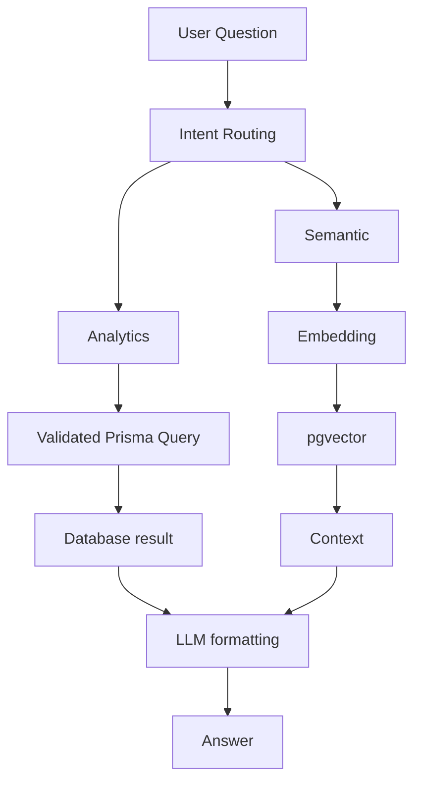

<!-- HEADER -->

  

  
  
  
  

  
  

---

## 👨‍💻 About

Full-Stack Developer with **2.5+ years** of professional experience building scalable, maintainable, production-grade systems. Contributed to **17+ enterprise applications** across warehouse management, healthcare, HR, education, and ride-sharing.

My focus is **backend architecture, AI-powered applications, and Retrieval-Augmented Generation (RAG)**.

| 🏢 Enterprise Apps | ⏳ Experience | 🧠 Focus | 🛠️ Core Stack |
|:---:|:---:|:---:|:---:|
| **17+** | **2.5+ yrs** | **Backend · AI/RAG** | **Node · TS · PostgreSQL** |

---

## 🧰 Tech Stack

**Languages**

**Backend**

**Frontend**

**Databases & Infrastructure**

<b>🔎 Full expertise breakdown</b>

 

| Area | Technologies |
|---|---|
| Backend & APIs | Node.js, Express.js, TypeScript, Laravel, PHP, REST |
| Databases | PostgreSQL, MongoDB, MySQL, Redis, pgvector |
| AI / Retrieval | RAG, embeddings, semantic search, Ollama (local LLMs) |
| Messaging & Realtime | BullMQ, Socket.IO, event-driven design |
| Security | RBAC, authentication, validated query execution |
| DevOps | Docker, AWS, Linux, CI/CD |
| Fundamentals | Data Structures & Algorithms, system design |

---

## 🚀 Featured Project
### 🤖 [AI-Powered Education Management System](https://github.com/mdalmamunDev/AI-Powered-Education-Managment-RAG)

Enterprise education platform combining traditional management architecture with **RAG, semantic search, and AI analytics**, secured by dynamic RBAC.

  
  
  
  
  
  

**Highlights**
- 🧭 Intent-based routing across analytics, retrieval, and general queries
- 🛡️ Validated database queries keep AI-generated access safe and scoped
- ⚡ Real-time progress and response streaming via Socket.IO
- 🔐 Dynamic RBAC with roles, modules, and permissions

---

## ⚡ Engineering Highlights

- 🏗️ Built reusable backend templates, cutting delivery time across projects
- 🚀 Improved response performance with Redis caching and optimized data flow
- 🔄 Replaced polling with event-driven location updates
- 📨 Queue-based notification processing with BullMQ
- 💳 Payment integrations: 3-D Secure, subscriptions, mandates, webhooks, idempotency
- 🐳 Containerized with Docker and deployed on AWS
- 👥 Led development on multiple projects

---

## 📚 Currently Learning

  
  
  
  
  

---

## 📊 GitHub Analytics

---

## 🤝 Let's Connect

I'm open to backend, full-stack, and AI engineering opportunities.

 

